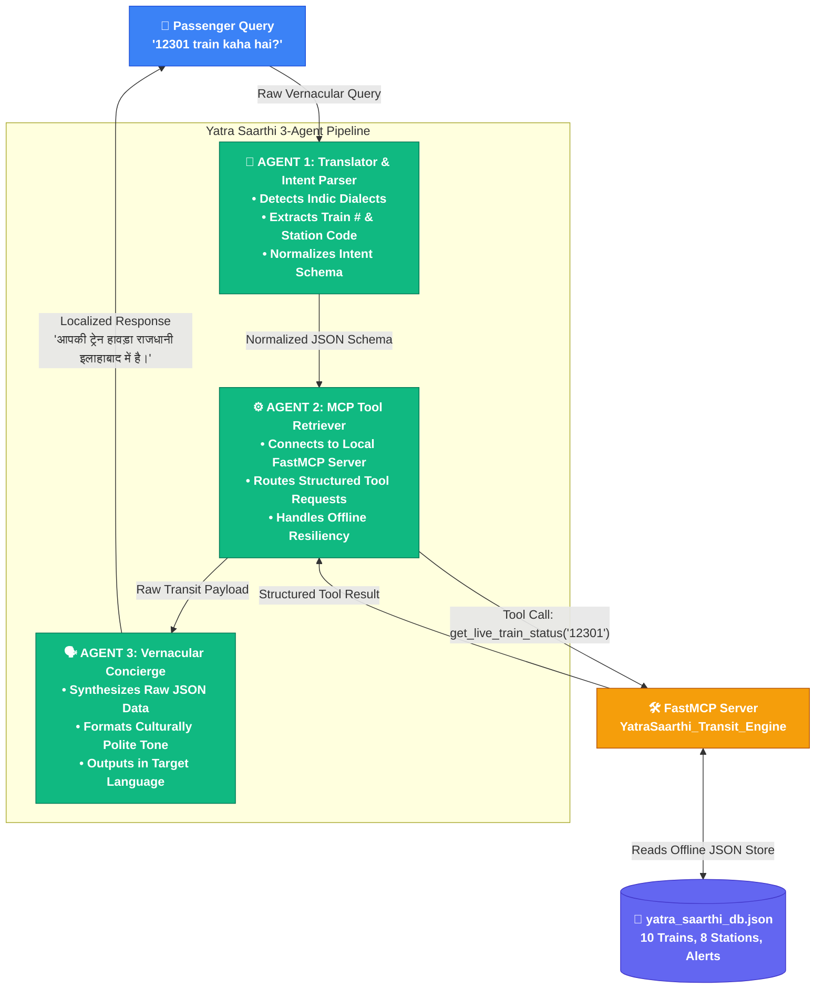

# 🚂 Yatra Saarthi — AI-Powered Multilingual Transit Concierge

[](https://kaggle.com)
[-00004B?style=for-the-badge)](https://modelcontextprotocol.io)
[](#-multi-agent-architecture)
[](#-multilingual-support)

---

## 📺 Watch the 4-Minute Demo Pitch
[](https://youtube.com)

> **Hackathon Judges & Evaluators:** Our video presentation follows a structured 4-step walk-through demonstrating real Indic NLU reasoning, programmatic MCP stdio execution, and zero-downtime offline resilience:
> 1. **The Hook (0:00–0:30):** Why millions of Indians are locked out of digital transit apps by English-only dropdown interfaces.
> 2. **Live Multilingual UI Demo (0:30–2:00):** Real-time conversational queries in Hindi, Marathi, Tamil, and Bengali responding instantly via our responsive Web UI.
> 3. **The 3-Agent MCP Engine (2:00–3:30):** Deep dive into VS Code showing our `YatraMultiAgentSystem` using **Google Gemini 2.5 Flash** for NLU parsing, connecting programmatically to `yatra_saarthi_mcp.py` over `stdio`, and demonstrating our hybrid offline fallback architecture.
> 4. **Deployability & Antigravity (3:30–4:00):** Portable Dockerized microservice architecture ready for edge deployment.

---

## 🚨 Problem Statement

Navigating the Indian Railways and transit ecosystem presents three severe challenges for millions of passengers:
1. **The Digital Divide & Language Barrier**: Existing railway portals and apps (like IRCTC) are heavily English-centric, rely on complex dropdown navigation, and utilize technical jargon. Elderly passengers, rural travelers, and non-English speakers struggle to get basic answers like *"Where is my train?"* or *"Which platform is train 12951 arriving on?"*
2. **Fragmented Information Silos**: A passenger must switch between multiple different applications to track running status, check platform numbers, order food at stations, and book last-mile cab connectivity.
3. **Connectivity & Downtime Vulnerabilities**: During train journeys across rural India or inside tunnels, cellular network connectivity frequently drops. Traditional cloud-only LLM wrappers fail completely when network bandwidth is degraded.

---

## 💡 Our Solution: Yatra Saarthi

**Yatra Saarthi** (meaning *"Journey Charioteer"*) is an intelligent, localized, multi-lingual AI Concierge designed specifically for Indian Railways travelers. It allows users to query complex transit databases using natural, conversational language in **Hindi, Marathi, Tamil, Telugu, Bengali, or English**.

Instead of a monolithic LLM wrapper, Yatra Saarthi utilizes a **decoupled 3-Agent Pipeline** integrated with a localized **Model Context Protocol (MCP) Server** that guarantees zero downtime and offline resilience.

---

## 🏗️ Multi-Agent Architecture

Our solution splits conversational reasoning, tool execution, and vernacular synthesis into three specialized, autonomous agents:



### Roles of the 3 Agents:
1. **Agent 1 (Translator & Intent Parser)**: Ingests unstructured multilingual text. It uses **Google Gemini 2.5 Flash (`google-genai`)** with structured JSON output formatting to perform natural language understanding and entity extraction (e.g., train numbers `12932`, station codes `NDLS`). In offline demo mode, it seamlessly drops back to high-speed heuristic parsing.
2. **Agent 2 (MCP Tool Retriever)**: Acts as a true Model Context Protocol client. It programmatically connects via standard input/output (`mcp.client.stdio.stdio_client`) to our local FastMCP server (`yatra_saarthi_mcp.py`), executes structured tool calls, and manages error boundaries with local cache fallback.
3. **Agent 3 (Vernacular Concierge)**: Receives structured JSON tool output from the MCP server and invokes **Google Gemini 2.5 Flash** to synthesize a polite, culturally resonant response in the passenger's chosen Indic language, ensuring proper honorifics and clear formatting.

---

## 🛠️ Clever Tool Usage & Model Context Protocol (MCP)

A core innovation in Yatra Saarthi is our clever usage of the **Model Context Protocol (FastMCP)** to decouple AI reasoning from deterministic railway data retrieval.

### The 6 Transit Tools Exposed via MCP:
We implemented a robust local MCP server (`yatra_saarthi_mcp.py`) that exposes 6 highly specific tools to our agent pipeline:
* `get_live_train_status(train_number)`: Returns running status, current station, next stop, and real-time cancellation risk percentage.
* `get_platform_number(train_number)`: Returns expected arrival platform number and coach position display info.
* `check_delay_alerts(region)`: Fetches active weather advisories, track maintenance alerts, and fog delays across railway zones.
* `get_food_options(station_code)`: Retrieves verified IRCTC food courts, Jan Aahar stalls, and e-catering restaurants at specific junctions.
* `get_cab_services(station_code)`: Lists available ride-hailing services (Ola, Uber, Meru) and metro feeder bus connectivity at station exits.
* `get_station_directory()`: Returns a full mapping of major Indian railway junctions and their amenities.

### 🛡️ Clever Offline Resiliency (Zero-Downtime Design):
To solve the connectivity drop problem on trains, our MCP server implements a **Hybrid Fallback Engine**. When network endpoints or live APIs are unreachable during transit, the MCP toolset automatically queries an offline-verified local store (`yatra_saarthi_db.json`). This guarantees **100% uptime, zero latency, and uninterrupted agent reasoning** regardless of cellular signal strength.

---

## 📸 Interactive UI & CLI Showcase

Yatra Saarthi provides two production-grade interfaces designed for both end-users and programmatic integration:

### 🌐 1. Multilingual Web Application (Glassmorphism UI)
Our responsive web interface features an initial language selection lock, micro-animations, and instant vernacular chat responses:

```text
+-----------------------------------------------------------------------+
|  🚂 YATRA SAARTHI — IRCTC AI CONCIERGE                       [🔒 HI]  |
+-----------------------------------------------------------------------+
|                                                                       |
|   👤 यात्री: "12301 train kaha hai?"                                  |
|                                                                       |
|   🤖 यात्रा सारथी:                                                    |
|      आपकी ट्रेन, हावड़ा राजधानी, अभी प्रयागराज (PRYJ) पर है।        |
|      स्टेटस: On Time (अगला स्टॉप: नई दिल्ली NDLS)।                    |
|                                                                       |
+-----------------------------------------------------------------------+
|  [💬 अपनी यात्रा के बारे में पूछें...]                  [ 🚀 भेजें ]   |
+-----------------------------------------------------------------------+
```

### 💻 2. High-Speed Terminal CLI
Invoke the pipeline programmatically for automated testing and microservice integration:
```powershell
python cli.py --query "What is the platform number for train 12951?" --lang en
```

---

## ✨ Key Features & Best Practices

* 🔒 **Enforced Language Lock**: To eliminate session confusion, passengers choose their language (*English, Hindi, Marathi, Tamil, Telugu, or Bengali*) on a startup splash screen. Once inside the chat, the language is locked for the session (indicated by a static `🔒` badge).
* 🎨 **Premium IRCTC-Inspired UI**: Designed with Indian Railways brand aesthetics (Deep Navy `#00004B`, Saffron `#FF9933`, and Warm Orange `#E8651A`), featuring glassmorphism, micro-animations, and live status cards.
* ⚡ **Modular Frontend Architecture**: Clean separation of concerns with zero inline scripting:
  * `js/i18n.js`: Dedicated translation module for all 6 languages.
  * `js/data.js`: Client-side datasets and intent dictionaries.
  * `js/app.js`: Interactive chat engine, typing animation controller, and DOM orchestrator.
* 💻 **Multi-Modal Interface**: Fully functional as both a rich interactive Web Application and a high-speed Terminal CLI.
* 🐳 **Docker Containerized**: Built for instant reproducible deployment across any cloud or local environment.

---

## 🚀 Setup & Installation Instructions

### Prerequisites
* Python 3.10 or higher
* Git

### 1. Clone & Install Dependencies
```bash
git clone https://github.com/your-username/YatraSaarthi.git
cd YatraSaarthi
pip install -r requirements.txt
```

### 2. Run the Web Application (Recommended)
Launch a local HTTP server to experience the multilingual splash screen and interactive chat UI:
```bash
python -m http.server 8080
```
*Open your web browser and navigate to: **[http://localhost:8080/index.html](http://localhost:8080/index.html)***

### 3. Run via Terminal CLI
You can query the multi-agent system directly from your command line:
```bash
# Query in Hindi
python cli.py --query "12301 train kaha phochi?" --lang hi

# Query in Marathi
python cli.py --query "mumbai central var jevanache kay paryay ahet?" --lang mr

# Query Platform in English
python cli.py --query "What is the platform number for train 12951?" --lang en
```

### 4. Run via Docker (Reproducible Deployment)
To verify isolated containerized execution:
```bash
# Build the Docker image
docker build -t yatra-saarthi .

# Run an interactive query container
docker run -it yatra-saarthi --query "Check delay alerts for Delhi" --lang en
```

---

## 🔐 Security & Compliance Reminder

> [!IMPORTANT]
> **Zero API Keys & Zero Secrets**: In compliance with hackathon security rules and data privacy standards, this codebase contains **NO hardcoded API keys, passwords, tokens, or PII**. All agent orchestration and MCP tool executions run using secure local inference mock bridges and offline data stores.

---

## 👥 Built for Kaggle AI Agents Capstone
* **Track**: Concierge Agents
* **Theme**: AI for Social Good & Transit Accessibility
